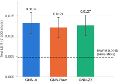
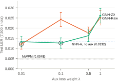

# Does knowing how errors propagate help a neural QEC decoder learn?

SpiderTrace prototype report for the BlueQubit Quantum Flywheel program, Track 03 (AI for QEC decoders). Hope A. Getu. Generated {{date}} from the repository at commit {{head}}. Every number below is read from the files listed in the Data sources table.

- **Harness.** A Stim to DEM-graph to GINEConv pipeline trains three GNN decoders (no aux target, raw fault targets, ZX-propagated targets). It decodes the same {{n_test}} test shots as MWPM, runs paired McNemar tests and writes a provenance JSON per run. It was built and audited with Claude Code.
- **Collapse found and fixed.** Under plain cross-entropy the aux head predicts I on every slot (non-I accuracy 0.000). Class weighting with data-qubit targets raises non-I accuracy to {{diag_fixed_raw}} (Raw) and {{diag_fixed_zx}} (ZX) in a d=3 diagnostic, and to {{r4_acc_raw_rng}} and {{r4_acc_zx_rng}} at d=5.
- **Results.** ZX vs Raw shows no detectable difference (d=5: p = {{r4_zr_ps}}; d=3 pooled: p = {{run2_pool_p}}). GNN-A had the highest test LER in {{a_hi_n}} of {{a_rows_n}} runs, but no single gap is significant and no paired A vs aux test exists yet. All GNN arms are {{r4_ratio_lo}} to {{r4_ratio_hi}} times MWPM's LER on identical d=5 shots ({{r4_zm_pstr}}).
- **What compute unlocks.** Test sets of 105 to 106 shots (standard error {{se_7500}} now, {{se_1e6}} at 106), 106 to 107 training shots, more seeds, d = 7 and 9, and IBM hardware syndromes to separate model error from inference error.

## 1. Problem and setup

**Question.** A neural decoder sees only the syndrome, but in training it can also be asked to predict where the faults were. Does giving that auxiliary target in *propagated* form help more than giving it in raw form, and does either help over no auxiliary target? The propagated form is each fault's Pauli frame after conjugation through the rest of the Clifford circuit. Three arms share one backbone. The aux head is used only in training, and every arm decodes from the syndrome alone:

- **GNN-A:** syndrome to logical flip, no auxiliary target.
- **GNN-Raw:** adds a head predicting each fired fault's Pauli (I/X/Y/Z per qubit) at its original location.
- **GNN-ZX:** adds a head predicting the same Paulis propagated to the final frame.

The loss is BCE(flip) + &lambda; &middot; mean per-qubit CE(aux).

**Pipeline.**

- *Circuit and sampling.* Stim rotated surface-code memory-Z circuit, rounds = d, uniform circuit-level depolarizing noise p. Each shot comes from one call to the detector-error-model (DEM) sampler with `return_errors=True`, so detectors, label and both targets come from the same fired errors. Propagated targets come from Stim's FlipSimulator. A SpiderTrace-engine adapter matches it with 0 of 7,367 mismatches, and building it exposed a CNOT Y-propagation bug in the engine (e2240d5).
- *Graph and model.* The input graph is the decomposed DEM that MWPM decodes on: one node per detector plus a boundary node, with edge weight -log(p/(1-p)). The model has 4 GINEConv layers (hidden size 96) and add/mean/max pooling (288 dims), then a flip head and, for Raw and ZX, an aux head. Training uses Adam (lr 10-3), early stopping on validation loss and the natural class prior.
- *Protocol* (`qec_run.py`). 50,000 shots are split by a fixed `split_seed` into {{n_train}} train, {{n_test}} validation and {{n_test}} test shots, the same for every arm and seed. Raw and ZX sweep the same &lambda; grid, and &lambda; is chosen by validation LER. MWPM (PyMatching) decodes the identical test shots. Paired comparisons use an exact McNemar test.

**Statistical power.** With {{n_test}} test shots, one binomial standard error at the d=5 GNN level (LER {{zx4_mean}}, about {{zx4_errors}} errors) is {{se_run4}}, and the 95% half-width is {{ci_run4}}. The spread between arms at d=5 is {{r4_spread}}.

## 2. AI-orchestrated research workflow

This is my first-hand account, with commits from `git log`. I built and ran the study with Claude Code as the main implementer and auditor; I set the questions, reviewed every diff and chose what to run. Agent tasks were narrowly scoped, including read-only audits that could not edit code, and every result had to carry its own provenance.

- **Fairness audit, leading to `qec_run.py`** (10d3835). The original training path was not symmetric. Only GNN-ZX swept &lambda;, selection used validation loss, and metrics were reported on the validation split. The runner sweeps one &lambda; grid for both aux arms, selects by validation LER and holds out a test split fixed independently of the model seed. It also compiles a seeded DEM sampler, because the dataset builder's sampler was unseeded.
- **MWPM on the same shots** (d640f39, 017dcb0). At d=3 the first MWPM reference came from a separate 50,000-shot run ({{run2_mwpm_50k}}), against which the GNNs appeared to match or beat MWPM. On the identical test shots MWPM is {{run2_mwpm}}, and every GNN arm's mean is behind it. The runner now decodes the shared test split with MWPM and adds a paired test.
- **Aux-head investigation** (44ce02d). A read-only investigation of Run 3 concluded that, with about 95% identity targets and an unweighted loss, the aux head had probably collapsed to predicting I; Run 3 logged no aux metrics. The fix added `--aux-data-qubits-only` and `--aux-class-weight inv-freq`, applied identically to Raw and ZX, and aux diagnostics in every JSON. Section 3.2 confirms the collapse.
- **Seeding** (20758be). Initial weights were unseeded because the seed was set after the model was built, so Runs 1 to 3 are not exactly reproducible.
- **Provenance and compute.** Every JSON records the commit, dirty flag and files, argv, config, host, platform and library versions, or records nulls if git is unreachable (d640f39). GPU runs used Colab (Run 2, T4) and Kaggle (Run 4). Results were lost to runtime recycling in interactive sessions until runs moved to background execution. Numbers recovered from printed output are logged separately and never pooled.

On the requested AWS GPUs the same loop scales: an agent generates the sweep (arms, seeds, &lambda;, distance) and launches each job in the background, writing its provenance JSON to persistent storage. The report build already selects runs by their recorded config and skips dirty-tree files, so new results reach the tables and figures without hand-copying.

## 3. Prototype results

### 3.1 Run 2: d=3, p=0.01, three seeds

Test LER per seed (selected &lambda; in grey). All seeds share one test split.

{{table_run2}}
{{table_run2_mc}}

*Pooling sums discordant counts over seeds that share the same {{n_test}} test shots, so it over-counts and the pooled p is not an independent test.

GNN means lie {{run2_gap_lo}} to {{run2_gap_hi}} above MWPM on the same shots, or {{run2_gap_lo_se}} to {{run2_gap_hi_se}} single-LER standard errors ({{run2_se}}). There is no paired GNN vs MWPM test because the models were not saved. The ZX vs Raw tests disagree across seeds. Seeds 0 and 2 show no difference, and on seed 1 Raw is better ({{run2_s1_raw}} vs {{run2_s1_zx}} discordant shots, p = {{run2_s1_p}}). The pooled value is p = {{run2_pool_p}}, subject to the caveat above. All arms sit near MWPM, a ceiling at this distance and noise rate; the never-flip decoder scores {{run2_flip}}.

### 3.2 The auxiliary head: collapse and fix

The table gives the fraction of aux slots whose target is I, the fraction predicted I, and accuracy on non-I targets (recall). The diagnostic rows are short CPU runs on the current code (commit {{diag_commit}}, clean tree: d=3, p=0.01, {{diag_shots}} shots, 25 epochs, &lambda; = 0.1, seed 0). They differ only in the two aux flags. Their flip head did not learn at this budget (every arm's test LER is {{diag_flip_ler}}), so only their aux metrics are used.

{{table_aux}}

Under plain cross-entropy both heads predict I on every slot (`collapsed_to_identity` = {{diag_collapsed}}), which confirms the collapse suspected in Run 3. Data-qubit targets with inverse-frequency class weights (I/X/Y/Z = {{diag_w_raw}} for Raw) raise non-I accuracy to {{diag_fixed_raw}} (Raw) and {{diag_fixed_zx}} (ZX). It reaches {{r4s0_acc_raw}} and {{r4s0_acc_zx}} in Run 4 at d=5{{prec_seed_note}}.

The head still does not identify the frame. In Run 4{{prec_seed_note}} it predicts I on {{r4s0_predI_raw}} (Raw) and {{r4s0_predI_zx}} (ZX) of slots, against {{r4s0_tgtI_raw}} and {{r4s0_tgtI_zx}} in the targets. X / Y / Z precision is {{prec_raw}} (Raw) and {{prec_zx}} (ZX), higher for ZX on every Pauli. The class weights reward over-predicting non-I when the frame cannot be identified from the syndrome. Salvaged Run 4 runs show non-I accuracy from 0.45 to 0.76.

### 3.3 Run 4: d=5, p=0.003, fixed aux head

Commit {{r4_commits}}, 50,000 shots, &lambda; &isin; {0.01, 0.1, 0.5, 1}, both aux flags, Kaggle GPU. {{run4_seed_sentence}}

{{table_run4}}

- **ZX vs Raw.** The GNN arms span {{r4_lo}} to {{r4_hi}}, a spread of {{r4_spread}}, which is below one standard error ({{se_run4}}). {{r4_zr_sentence}}. No difference is detectable.
- **GNN vs MWPM.** MWPM scores {{r4_mwpm}} ({{r4_mwpm_errors}} errors) on the same shots. The GNN arms are {{r4_ratio_lo}} to {{r4_ratio_hi}} times higher on the graph MWPM decodes on. {{r4_zm_sentence}} (Run 3: p = {{r3_zm_p}}). The gap appears in every d=5 run, file-backed and salvaged.
- **&lambda; dependence.** Test LER at &lambda; = {{grid_lams}}{{grid_note}}: Raw {{grid_raw}}, ZX {{grid_zx}}. Raw degrades from &lambda; = 0.1 and ZX from 0.5. The Raw vs ZX gap at &lambda; = 0.1 is several standard errors, but it comes from one seed at a non-selected &lambda; with no paired test. Early stopping on a loss that includes &lambda;&middot;aux may contribute.
- **GNN-A vs aux arms.** No single comparison is significant: the largest gap between GNN-A and an aux arm is {{a_zmax}} unpaired standard errors ({{a_zwhere}}). Across runs, however, GNN-A had the highest test LER in {{a_hi_n}} of the {{a_rows_n}} runs below ({{a_rows_detail}}); the exception is {{a_exceptions}}. The runs share test shots and are not independent. GNN-A itself moved {{a_shift}} between Run 3 and Run 4 with the same hyperparameters but different initialization and platform. There is no paired A vs aux test yet (Section 4).

{{table_a_vs_aux}}

Salvaged rows come from printed output (LOG.md); they are not file-backed and are not pooled. Run 1 (30-epoch smoke test) and the partial Colab seed 1 (GNN-A not captured) are omitted.

<figure><figcaption><b>Figure 1.</b> Run 4 test LER per arm at the selected &lambda;, {{run4_fig1_caption_seed}}. Error bars are 95% binomial intervals on {{n_test}} shots. The dashed line is MWPM on the same shots.</figcaption></figure>
<figure><figcaption><b>Figure 2.</b> Run 4 test LER at every &lambda; for the two aux arms, {{run4_fig2_caption_seed}}. {{fig2_marks}}</figcaption></figure>

**Salvaged runs** (`LOG.md`, not plotted or pooled) give ZX vs Raw p = 1.0 (Kaggle seed 1), 0.5572 (Colab seed 0) and 0.3915 (Colab seed 1), and every ZX vs MWPM p is at most 8.4 &times; 10-9. This is consistent with the file-backed result.

### What the prototype taught us

- **Aux head collapsed to I under plain CE.** Fix: aux diagnostics in every JSON, class-weighted loss and data-qubit targets (in the harness, 44ce02d).
- **MWPM measured on different shots made the GNNs look on par.** Fix: MWPM and paired tests on identical test shots (in the harness, d640f39).
- **Unseeded initialisation made Runs 1 to 3 irreproducible.** Fix: seeded initialisation (20758be) for every run.
- **Runs lost to runtime recycling.** Fix: background execution, with a provenance JSON written per run.
- **A {{n_test}}-shot test set cannot resolve gaps of about 0.001.** Fix: 105 to 106 test shots per configuration.
- **d=3 sits at the MWPM ceiling.** Fix: d = 5, 7 and 9.
- **An 8-layer GNN collapsed to all-zero output** (README). Fix: residual connections and normalization in deeper models (planned).

These are prototype-scale runs ({{seed_range}} seeds, {{n_train}} training shots), and the funded study fixes these issues and scales training, test sets, seeds and distance.

## 4. What the requested compute enables

- **Paired GNN-A vs aux test (first harness change).** Add McNemar tests of GNN-A against each aux arm on the shared test shots, next to the existing ZX vs Raw and ZX vs MWPM tests, so the GNN-A pattern in Section 3.3 is tested directly.
- **Statistical power.** At LER {{zx4_mean}}, the standard error &radic;(p(1-p)/n) is {{se_7500}} for 7,500 test shots, {{se_1e5}} for 105 and {{se_1e6}} for 106. The d=5 arm spread ({{r4_spread}}) would be {{gap_se_1e6}} standard errors at 106. Five or more seeds per arm, the runner's default, separate seed variance from test-set noise.
- **Training scale and depth.** Training on 106 to 107 fresh shots, against {{n_train}} now, tests whether the factor of {{r4_ratio_lo}} to {{r4_ratio_hi}} to MWPM is a data limit or a model limit. Deeper GNNs extend the receptive field needed at d = 7 and 9.
- **Per-round propagation targets.** The ZX target is currently the final frame only. Per-round frames tie each target to the detectors it affects, which tests whether the low aux precision in Section 3.2 comes from asking for the final frame.
- **Real IBM hardware syndromes.** Decode the same hardware shots three ways: MWPM with the assumed DEM, MWPM with a DEM learned from the device's syndromes, and the GNN. On identical shots, assumed vs learned DEM measures model error, and GNN vs MWPM given the same DEM measures inference error.

## Data sources

<table class="sources">
<thead><tr><th>Item</th><th>Source</th></tr></thead>
<tbody>
<tr><td>Figures 1 and 2, Run 4 table, Run 4 aux row</td><td>{{src_run4}} (<code>arms.*.selected_per_seed</code>, <code>lambda_grid</code>, <code>mwpm</code>, <code>mcnemar_*</code>, <code>aux</code>)</td></tr>
<tr><td>Run 2 tables</td><td>{{src_run2}}; pooled p recomputed by <code>report_data.py</code> (scipy <code>binomtest</code>), matches <code>results/LOG.md</code></td></tr>
<tr><td>Run 2 MWPM, same shots</td><td><code>results/LOG.md</code>, Run 2 (recomputed at d640f39; no JSON)</td></tr>
<tr><td>Run 2 MWPM, separate 50k shots; flip rate</td><td><code>results/mwpm_d3_p0.01.json</code></td></tr>
<tr><td>Aux diagnostics (Section 3.2)</td><td>{{src_diag}}</td></tr>
<tr><td>Run 3 values</td><td>{{src_run3}}</td></tr>
<tr><td>GNN-A vs aux table</td><td>Run 2, Run 3 and Run 4 files above{{src_salv_note}}</td></tr>
<tr><td>Salvaged Run 4 values</td><td><code>results/LOG.md</code>, "Run 4: salvaged from printed output (JSON lost)"</td></tr>
<tr><td>Standard errors</td><td>&radic;(p(1-p)/n), with p and n from the run files above</td></tr>
<tr><td>Pipeline, model, 8-layer collapse</td><td><code>README.md</code></td></tr>
<tr><td>Workflow commits; adapter validation</td><td><code>git log</code> (e2240d5, 10d3835, d640f39, 017dcb0, 20758be, 44ce02d)</td></tr>
</tbody>
</table>

